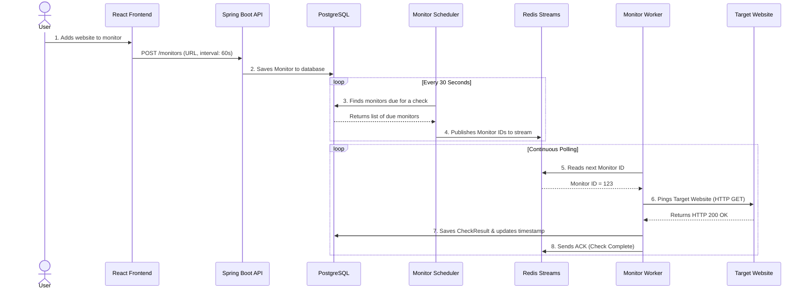
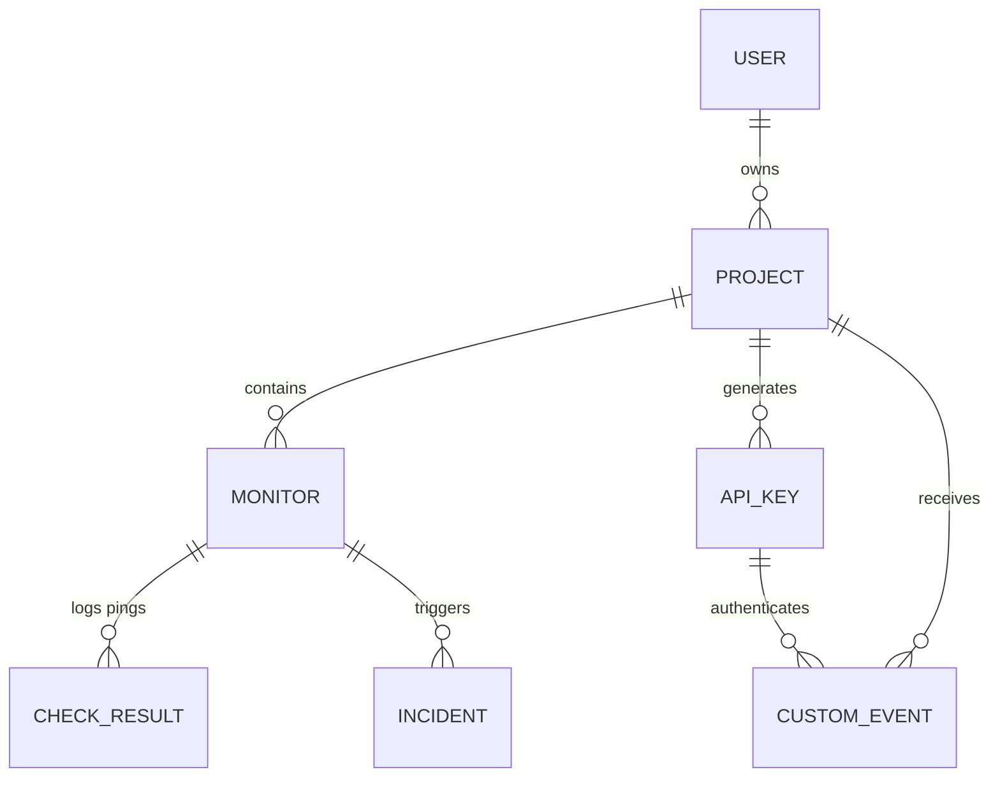

# UptimePulse - Project Study Guide

## 1. Project Overview
**UptimePulse** is an API Monitoring Platform as a Service (PaaS) built to continuously check the health, uptime, and performance of HTTP endpoints. It allows users to create projects, configure monitors with custom intervals, track incidents, and submit custom events via API keys.

### Core Tech Stack
* **Backend:** Java 21, Spring Boot 3.2, Spring Data JPA, Hibernate 6
* **Frontend:** React 18, Vite, Tailwind CSS (Modern Glassmorphism UI)
* **Databases:** PostgreSQL (Relational Data), Redis (Message Queues & Rate Limiting)
* **Deployment:** Docker & Docker Compose

---

## 2. System Architecture

### 2.1 How It Works (For Beginners)

Imagine you want to monitor a website (like `api.github.com`) to make sure it doesn't go down. If it does, you want to know immediately. Here is the step-by-step flow of how UptimePulse handles this behind the scenes:

1. **User Setup:** You go to the React frontend and enter the website URL and say, *"Check this every 60 seconds."*
2. **Database Storage:** The Spring Boot API saves your instructions into the **PostgreSQL** database.
3. **The Scheduler (The Dispatcher):** A background task (the `MonitorScheduler`) wakes up every 30 seconds. It looks at the database and asks: *"Which websites have waited longer than their configured interval?"* 
4. **The Queue (Redis):** Instead of checking the websites itself (which would be slow if there were thousands of websites), the Scheduler acts like a dispatcher. It throws the IDs of the due monitors onto a high-speed conveyor belt called **Redis Streams**.
5. **The Workers:** A separate group of workers (`MonitorWorker`) constantly watch the conveyor belt. When a monitor ID appears, a worker grabs it.
6. **The Check:** The worker actually visits the website (HTTP GET). 
7. **The Result:** The worker saves the result (e.g., "HTTP 200 OK, took 150ms") back to the database. Finally, it tells Redis *"I'm done!"* (ACK) so the message can be removed from the conveyor belt.

Here is a visual representation of that flow:

### 2.2 The Polling Engine (Redis Streams)
Instead of running HTTP checks synchronously, UptimePulse uses a distributed producer-consumer model for extreme scalability:
* **Producer (`MonitorScheduler.java`):** A cron job runs every 30 seconds. It executes a native PostgreSQL query to find all monitors whose `lastCheckedAt` timestamp is older than their configured `intervalSeconds`. The IDs of these due monitors are published as events to a **Redis Stream** (`monitor-checks`).
* **Consumer (`MonitorWorker.java`):** Background workers run in a continuous polling loop, listening to the Redis Stream via a Consumer Group. They pick up monitor IDs, execute the actual HTTP checks using Virtual Threads (Project Loom), record the `CheckResult`, and then `ACK` the message in Redis.

### 2.2 Security & Authentication
* **User Auth:** JSON Web Tokens (JWT). Handled via `JwtAuthFilter` and `SecurityConfig`.
* **API Keys:** Used for programmatic access (e.g., submitting custom events). Keys are cryptographically secure: a prefix is stored for quick lookups, but the actual key is hashed via BCrypt before storage.

---

## 3. Database Schema (PostgreSQL)

Key entities and their relationships:
* **User:** Top-level account owner.
* **Project:** Groups related monitors, alerts, and incidents. Belongs to a User.
* **Monitor:** An individual HTTP endpoint to check (URL, method, expected status, interval). Belongs to a Project.
* **CheckResult:** A time-series log of a single ping (latency, status, success boolean). Many-to-One with Monitor.
* **Incident:** Represents a period of downtime. Many-to-One with Monitor.
* **ApiKey:** Credentials for programmatic access. Many-to-One with Project.
* **CustomEvent:** Arbitrary payloads submitted via API keys.

### Visual Database Diagram (ERD)

---

## 4. Rate Limiting (Redis Sliding Window)

To protect the `EventController` from abuse, a strict rate limiter is enforced (60 requests/minute per API key).

**How it works (Sliding Window Algorithm):**
1. When a request arrives, the API key is validated against the database.
2. The validated key's internal database `ID` is used as the rate-limit bucket identifier.
3. A **Redis Sorted Set (ZSET)** is used to track timestamps of requests.
4. An atomic Redis pipeline performs the following:
   * Removes all entries older than exactly 60 seconds (`ZREMRANGEBYSCORE`).
   * Adds the current request timestamp to the set (`ZADD`).
   * Counts the total items remaining in the set.
5. If the count exceeds 60, a `429 Too Many Requests` is returned.

*Note: This sliding window approach prevents the "2x burst" exploit common in fixed-window limiters (e.g., sending 60 requests at 00:59 and 60 requests at 01:00).*

---

## 5. Frontend & UI/UX Design

The frontend recently underwent a major architectural and aesthetic overhaul:
* **Layout Paradigm:** The traditional left-sidebar was removed. The app uses a sticky, translucent top navigation bar (`TopNav.jsx`) with absolute pixel-perfect centering. The main content floats in a constrained `max-w-7xl` container.
* **Bento Box Grid:** The `Dashboard.jsx` uses a dense CSS Grid layout, arranging charts, incidents, and tables into interlocking "bento box" tiles.
* **Aesthetics ("Space Violet" Theme):** 
  * Replaced flat colors with `backdrop-blur-xl` glassmorphism panels.
  * Uses the modern `Outfit` typography.
  * Features vibrant neon-violet hover effects, gradients, and custom sleek scrollbars.
  * Polling: Dashboard pages auto-refresh every 10 seconds to show live data.

---

## 6. Critical Security & Logic Patterns to Study

During a recent backend audit, several critical flaws were found and fixed. These serve as excellent case studies for backend development:

1. **SSRF Prevention:** The `MonitorService` validates URLs before saving them. It strictly enforces `http` or `https` schemes and actively blocks internal network IP addresses (like `127.0.0.1`, `10.x.x.x`, `169.254.x.x`) to prevent Server-Side Request Forgery attacks.
2. **Preventing Message Loss (At-Least-Once Delivery):** In `MonitorWorker`, the Redis `acknowledge()` command is explicitly called *after* the HTTP check finishes. If it was called before processing, a worker crash would permanently lose that check.
3. **IDOR Prevention:** In `ApiKeyService.revoke()`, simply looking up an API key by its `ID` is insufficient. The service verifies that the key's `projectId` matches the authenticated user's current project before allowing deletion.
4. **Thread Pool Isolation:** The Redis polling loop (`XREADGROUP`) blocks waiting for data. If it ran on the same executor pool as the HTTP checks, thread starvation could freeze the entire worker. The polling loop was isolated to its own `SingleThreadExecutor`, while the actual HTTP tasks run on a `VirtualThreadPerTaskExecutor`.
5. **Hibernate Type Inference:** HQL/JPQL can struggle with database-specific time intervals. For complex interval math (`:now - interval`), using `nativeQuery = true` with explicit `CAST` statements bypasses Hibernate parsing errors.

---

## 7. API Endpoints Cheat Sheet

When the frontend talks to the Spring Boot backend, it uses these main REST API endpoints. All routes (except auth and public status) require a JWT Bearer Token.

### Authentication
* `POST /api/v1/auth/register` - Create a new user.
* `POST /api/v1/auth/login` - Get a JWT token.

### Projects & Monitors
* `GET /api/v1/projects` - List all projects for the logged-in user.
* `POST /api/v1/projects` - Create a new project.
* `GET /api/v1/projects/{projectId}/monitors` - List all endpoints being monitored in a project.
* `POST /api/v1/projects/{projectId}/monitors` - Add a new website/API to monitor.

### Incidents & Events
* `GET /api/v1/projects/{projectId}/incidents` - View ongoing and past downtime incidents.
* `POST /api/v1/projects/{projectId}/api-keys` - Generate a new API Key for programmatic access.
* `POST /api/v1/events` - Submit a custom event (Requires API Key in body. *Strictly Rate Limited to 60/min*).

---

## 8. Local Development & Testing

* **Running the Stack:** `docker compose up -d --build` handles the PostgreSQL database, Redis instance, Spring Boot backend, Nginx-served Vite frontend, Prometheus, and Grafana.
* **Ports:** 
  * Frontend: `:5173`
  * Backend API: `:8080`
  * Postgres: `:5432`
  * Redis: `:6379`
  * Grafana: `:3000`
