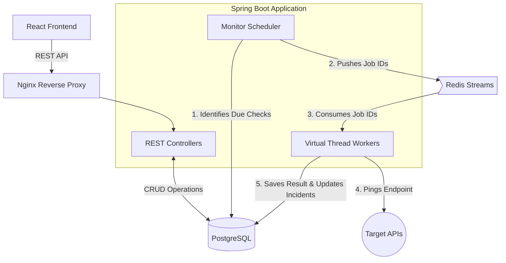

# UptimePulse — API Monitoring Platform

A production-grade API monitoring platform built with Java, Spring Boot, and React. It allows users to register API endpoints, monitors their uptime on a schedule, and generates real-time alerts if they go down.

## 🚀 Live Demo

**Frontend:** https://uptime-pulse.netlify.app/

* **Frontend:** Deployed on **Netlify**
* **Backend & Services:** Deployed on **Render**

> ⚠️ **Free-Tier Notice:** The backend and supporting services are hosted on Render's free tier. Free instances may spin down after a period of inactivity, so the first request after inactivity can take **around 50 seconds or more** while the services start up. Subsequent requests should respond normally.

## What problem does this solve?

Teams need to know the exact moment an API goes down, rather than waiting for a customer to complain. This project builds the core of an uptime-monitoring SaaS (similar to Better Stack or UptimeRobot). 

Users can register projects and attach HTTP monitors to them. The platform then polls those endpoints on a predefined schedule, automatically opens incidents upon failure, auto-resolves them upon recovery, and dispatches real-time alerts. It is designed with a decoupled architecture using Redis Streams and Java Virtual Threads to demonstrate how to build systems that scale independently of API request traffic.

## Tech Stack

- **Frontend:** React 18, Vite, Tailwind CSS, Recharts
- **Backend:** Java 21, Spring Boot 3.2, Spring Security, Spring Data JPA, Maven
- **Database:** PostgreSQL 16
- **Cache & Messaging:** Redis 7 (Redis Streams for the check-dispatch pipeline)
- **Deployment:** Docker & Docker Compose (with Nginx for SPA proxying)

## Core Features

- **JWT Authentication:** Stateless, secure user registration and login with BCrypt password hashing.
- **Project Management:** Multi-tenant architecture where users own projects, and projects own monitors.
- **Automated Health Checks:** Decoupled execution using Redis Streams and Java 21 Virtual Threads ensures high-throughput monitoring without thread exhaustion.
- **Incident Lifecycle:** Automatically opens incidents upon consecutive failures, tracks failure counts, and resolves them when the service recovers.
- **Customizable Alerts:** Dispatch alerts via in-app notifications and mock email channels.
- **Public Status Pages:** View the live status and historical uptime of any project without needing to log in.

## Architecture & Design

UptimePulse is designed with a decoupled, asynchronous architecture to ensure high throughput and prevent thread exhaustion when executing thousands of HTTP checks.



### How the Pipeline Works:

1. **The Scheduler:** A lightweight cron job runs every 30 seconds to query the PostgreSQL database for monitors that are due for a health check.
2. **The Stream:** Instead of executing the HTTP requests directly (which would block threads and cause bottlenecks), the scheduler pushes lightweight job IDs to a **Redis Stream** (`monitor-checks`).
3. **The Workers:** Background listeners powered by **Java 21 Virtual Threads** independently consume these jobs from Redis. 
4. **The Execution:** The workers execute the actual HTTP network calls, measure the latency, verify the status code, and then write the results back to the database.

This completely decouples the scheduling logic from the heavy lifting of network execution, allowing the check-execution tier to easily scale horizontally as the number of monitors grows.

## Testing

The project includes an automated test suite for the Spring Boot backend to ensure that the application context, database connections, and dependency injections load correctly.

To execute the tests (requires Maven):
```bash
cd backend
mvn test
```

### Smoke Testing

The `scripts/` directory contains bash scripts used to perform quick "smoke tests" against a deployed environment. These scripts ping the frontend, backend health endpoints, and Prometheus metrics to verify everything is alive and routing correctly.

If you have the Docker Compose environment running locally, you can verify it works by running:
```bash
./scripts/smoke-compose.sh
```

## Running Locally

**Prerequisites:** Docker and Docker Compose V2.

### Option 1: Using Docker Compose (Recommended)

```bash
# Clone the repository
git clone https://github.com/ishashanknigam/UptimePulse-API-Monitoring-Platform.git
cd UptimePulse-API-Monitoring-Platform

# Start all services using Docker Compose
docker compose up --build -d
```

### Option 2: Local Development without Docker

If you prefer to run the applications directly on your machine, you will still need PostgreSQL and Redis running (you can use Docker just for the databases if you wish).

**1. Start the Databases (Optional using Docker):**
```bash
docker run --name uptimepulse-postgres -e POSTGRES_DB=uptimepulse -e POSTGRES_USER=uptimepulse -e POSTGRES_PASSWORD=uptimepulse -p 5432:5432 -d postgres:16-alpine
docker run --name uptimepulse-redis -p 6379:6379 -d redis:7-alpine
```

**2. Start the Spring Boot Backend (Requires Java 21+ and Maven):**
```bash
cd backend
mvn spring-boot:run
```

**3. Start the React Frontend (Requires Node 20+):**
```bash
cd frontend
npm install
npm run dev
```

### Accessing the Application

| Service | URL |
|---|---|
| Frontend Dashboard | http://localhost:5173 |
| Backend API | http://localhost:8080 |
| Swagger Documentation | http://localhost:8080/swagger-ui.html |

**Demo Login:**
- **Email:** `demo@uptimepulse.dev`
- **Password:** `demo123`

## License

MIT
